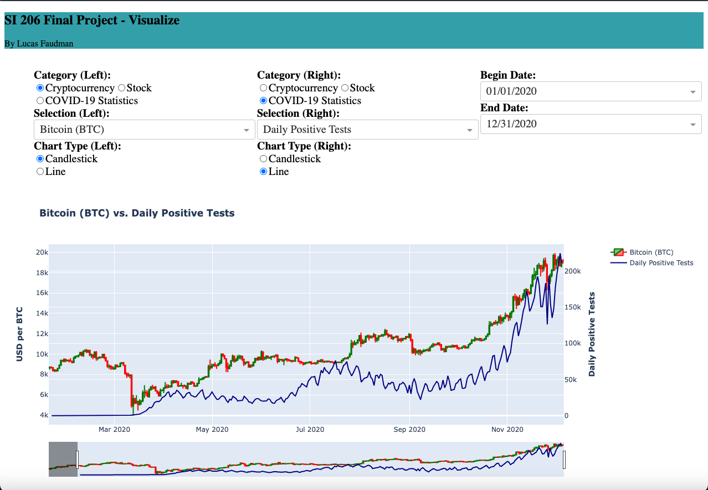

# Covid-vs-Crypto-vs-Stock-stats-visualized

## Description: 
This project is a data visualization of the Covid-19 pandemic, the stock market, and the cryptocurrency market. The data is pulled from the [Alpha Vantage API](https://www.alphavantage.co/documentation/), [CoinGecko API](https://www.coingecko.com/en/api), and [COVID-19 API](https://covid19api.com/). The data is then cleaned and stored in a sqlite database. The data is then pulled from the database and visualized using Plotly and Dash. The data is updated daily.

#### As required in the Final Project Spec: get.py, process.py, visualize.py files are all separate scripts. The get.py script pulls the data from the APIs and stores it in a sqlite database. The process.py script cleans the data and stores it in a sqlite database. The visualize.py script pulls the data from the database and visualizes it using Plotly and Dash. 

## How to run:
1. Clone the repository: ```git clone https://github.com/LucasFaudman/Covid-vs-Crypto-vs-Stock-stats-visualized```
2. Install the requirements:
```pip3 install dash dash-bootstrap-components pandas plotly pandas_datareader sqlalchemy```
3. Run the app:
```python3 visualize.py```

Screenshot of the app:



